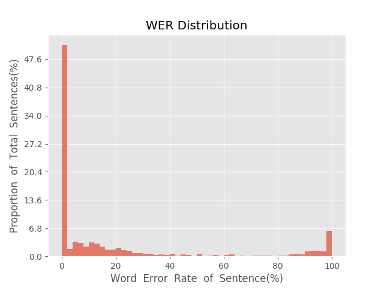
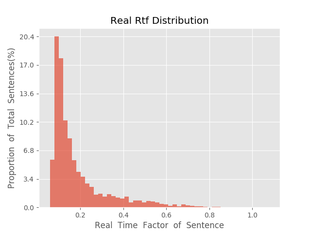

测 试 报 告

>	测试ID: ae0d141a-5a5b-11eb-a0b8-0242ac110007
>	开始时间: 2021-01-19 21:06:27
>	结束时间: 2021-01-19 21:39:58
>	测试引擎: 2.0:/home/admin/v2.6.3_16K
>	测试模型: /home/user/linjr/tmp_model/smbr_92f594046ce4423e9431b12fa29777fb_1611059355.net

##1. 句错误率分布

##2. 实时率分布

##3. 字错误率
20.71%
##4. rtf加权平均
0.19

