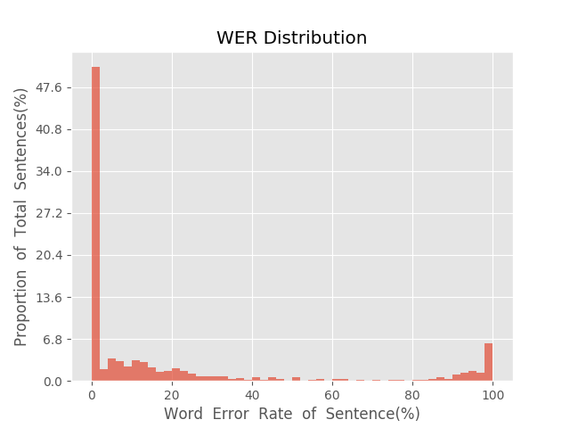
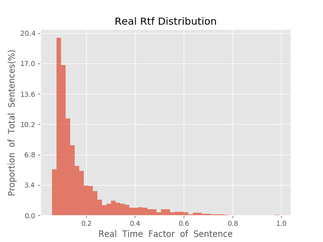

测 试 报 告

>	测试ID: ec3ff510-5a63-11eb-ad88-0242ac110007
>	开始时间: 2021-01-19 22:05:12
>	结束时间: 2021-01-19 22:38:58
>	测试引擎: 2.0:/home/admin/v2.6.3_16K
>	测试模型: /home/user/linjr/tmp_model/smbr_031643ad9898423dbc16e289a698b18b_1611064856.net

##1. 句错误率分布

##2. 实时率分布

##3. 字错误率
20.77%
##4. rtf加权平均
0.19

