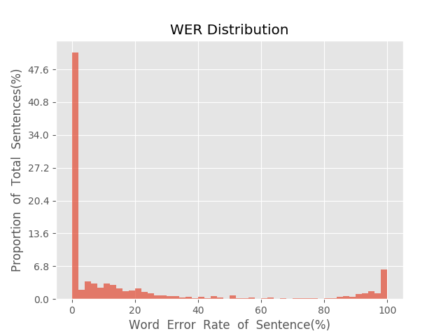
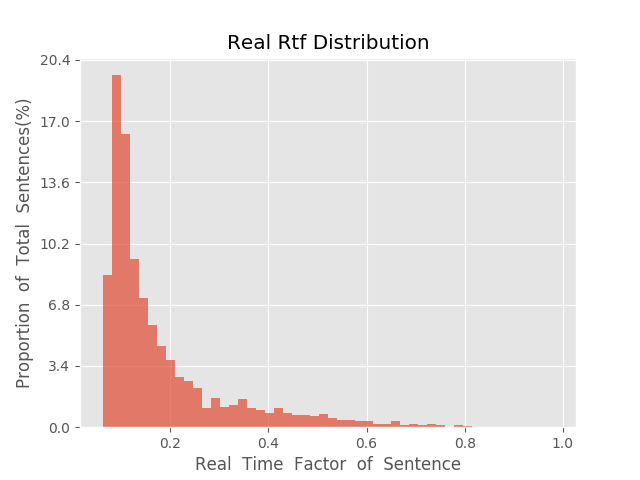

测 试 报 告

>	测试ID: 009b3490-5a6c-11eb-9f9f-0242ac110007
>	开始时间: 2021-01-19 23:03:20
>	结束时间: 2021-01-19 23:36:48
>	测试引擎: 2.0:/home/admin/v2.6.3_16K
>	测试模型: /home/user/linjr/tmp_model/smbr_94a956a9a5454e108de988886bb752d6_1611068345.net

##1. 句错误率分布

##2. 实时率分布

##3. 字错误率
20.65%
##4. rtf加权平均
0.19

