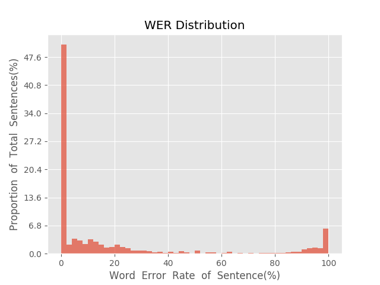
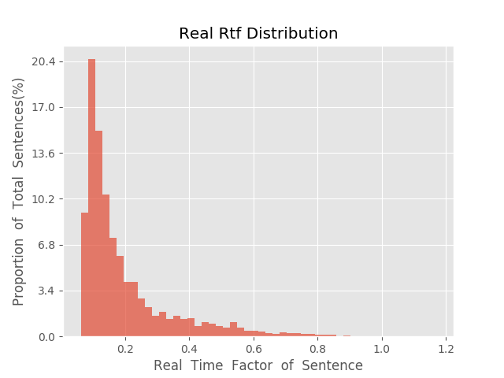

测 试 报 告

>	测试ID: f89a7442-5a73-11eb-848c-0242ac110007
>	开始时间: 2021-01-20 00:00:48
>	结束时间: 2021-01-20 00:33:51
>	测试引擎: 2.0:/home/admin/v2.6.3_16K
>	测试模型: /home/user/linjr/tmp_model/smbr_faa5e18ab21f411eb6fe6d095a6532e2_1611071793.net

##1. 句错误率分布

##2. 实时率分布

##3. 字错误率
20.74%
##4. rtf加权平均
0.2

