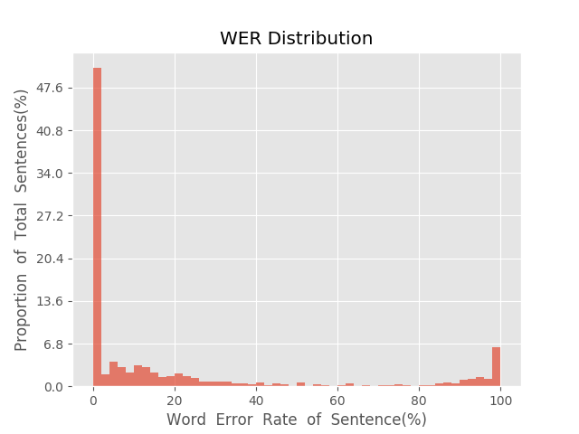

测 试 报 告

>	测试ID: f8606bbe-5a7b-11eb-a243-0242ac110007
>	开始时间: 2021-01-20 00:57:51
>	结束时间: 2021-01-20 01:31:06
>	测试引擎: 2.0:/home/admin/v2.6.3_16K
>	测试模型: /home/user/linjr/tmp_model/smbr_10740a70e5d54ad39c7f5ccca25d3973_1611075215.net

##1. 句错误率分布

##2. 实时率分布

##3. 字错误率
20.76%
##4. rtf加权平均
0.2

