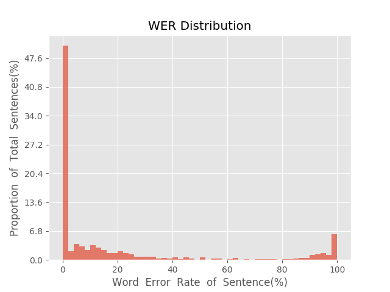
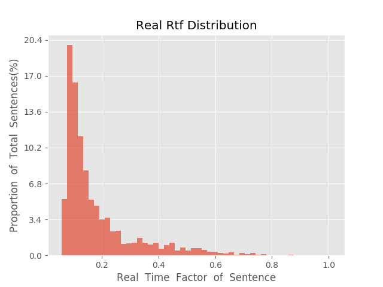

测 试 报 告

>	测试ID: 004ecc66-5a8c-11eb-ba61-0242ac110007
>	开始时间: 2021-01-20 02:52:41
>	结束时间: 2021-01-20 03:25:51
>	测试引擎: 2.0:/home/admin/v2.6.3_16K
>	测试模型: /home/user/linjr/tmp_model/smbr_3b16b092c6b14fce9c62c8436d9e3683_1611082104.net

##1. 句错误率分布

##2. 实时率分布

##3. 字错误率
20.72%
##4. rtf加权平均
0.19

