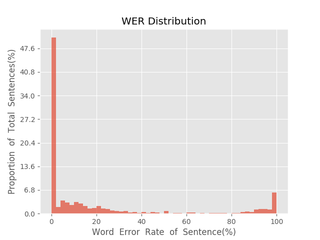
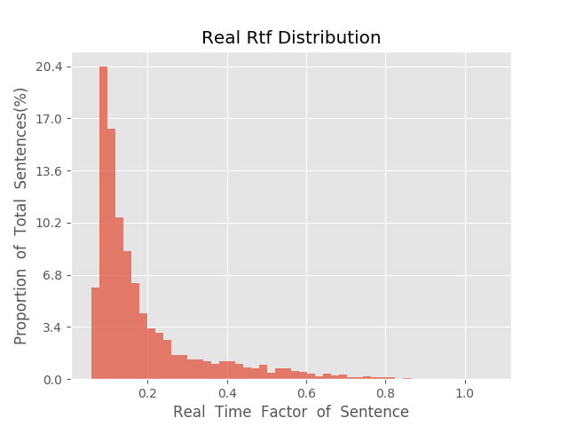

测 试 报 告

>	测试ID: 0f8dd58e-5a94-11eb-b2ba-0242ac110007
>	开始时间: 2021-01-20 03:50:39
>	结束时间: 2021-01-20 04:23:33
>	测试引擎: 2.0:/home/admin/v2.6.3_16K
>	测试模型: /home/user/linjr/tmp_model/smbr_bb0d7be2476d436f983d86d843aaceb3_1611085583.net

##1. 句错误率分布

##2. 实时率分布

##3. 字错误率
20.72%
##4. rtf加权平均
0.2

