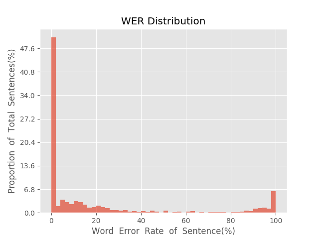

测 试 报 告

>	测试ID: f5ff62ce-5a9b-11eb-8d0e-0242ac110007
>	开始时间: 2021-01-20 04:46:37
>	结束时间: 2021-01-20 05:20:06
>	测试引擎: 2.0:/home/admin/v2.6.3_16K
>	测试模型: /home/user/linjr/tmp_model/smbr_f51b2e0b4c0c4391a26e9fa5d3d3c271_1611088942.net

##1. 句错误率分布

##2. 实时率分布

##3. 字错误率
20.76%
##4. rtf加权平均
0.19

