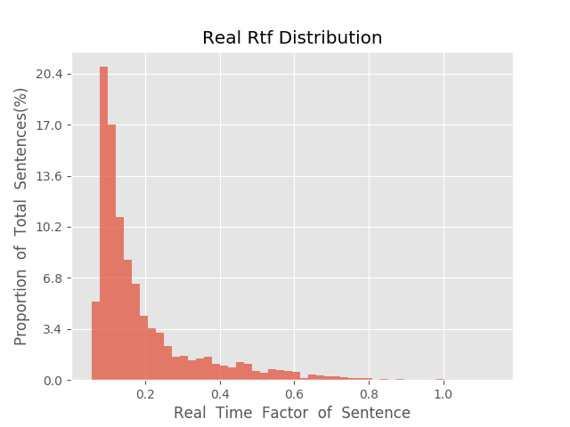

测 试 报 告

>	测试ID: 20b13616-5aa4-11eb-b037-0242ac110007
>	开始时间: 2021-01-20 05:44:47
>	结束时间: 2021-01-20 06:18:34
>	测试引擎: 2.0:/home/admin/v2.6.3_16K
>	测试模型: /home/user/linjr/tmp_model/smbr_e692f1eb09b8476ba0829d0b9089115e_1611092430.net

##1. 句错误率分布

##2. 实时率分布

##3. 字错误率
20.72%
##4. rtf加权平均
0.2

