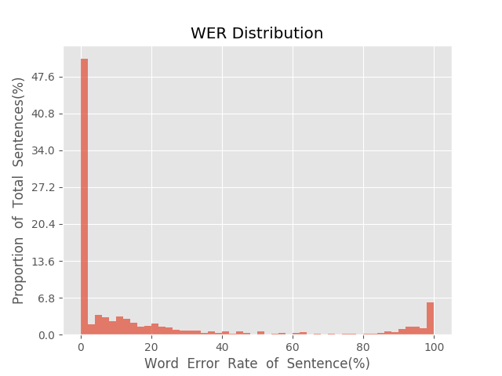
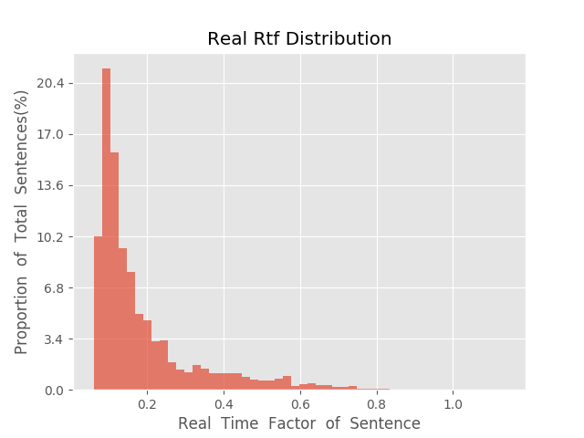

测 试 报 告

>	测试ID: f0d68f24-5aab-11eb-a1ec-0242ac110007
>	开始时间: 2021-01-20 06:41:29
>	结束时间: 2021-01-20 07:14:29
>	测试引擎: 2.0:/home/admin/v2.6.3_16K
>	测试模型: /home/user/linjr/tmp_model/smbr_64ea33b9dc2c4f2ea2c027e0432af855_1611095833.net

##1. 句错误率分布

##2. 实时率分布

##3. 字错误率
20.69%
##4. rtf加权平均
0.2

