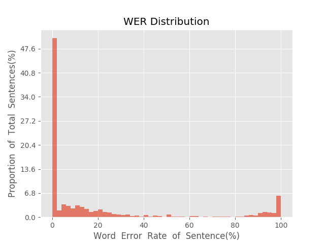
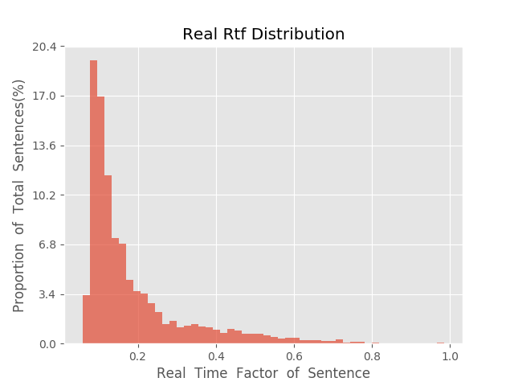

测 试 报 告

>	测试ID: e5ee6e76-5ab3-11eb-9eed-0242ac110007
>	开始时间: 2021-01-20 07:38:19
>	结束时间: 2021-01-20 08:11:27
>	测试引擎: 2.0:/home/admin/v2.6.3_16K
>	测试模型: /home/user/linjr/tmp_model/smbr_0f2371d136824b55a3321e3c62541fb3_1611099243.net

##1. 句错误率分布

##2. 实时率分布

##3. 字错误率
20.7%
##4. rtf加权平均
0.19

