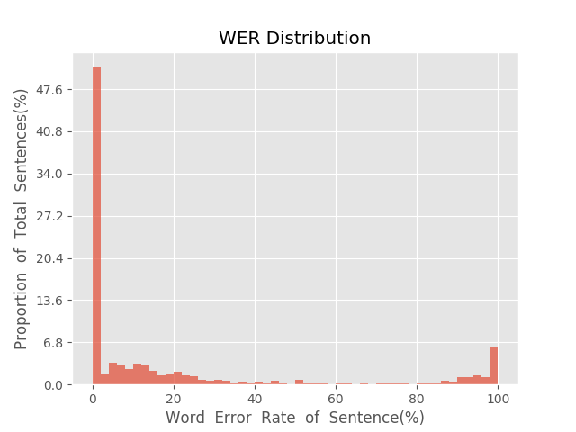
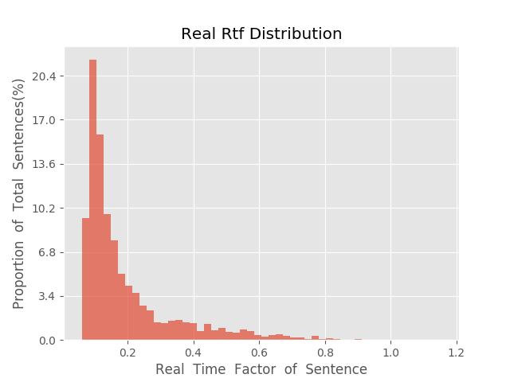

测 试 报 告

>	测试ID: 0bbdceb4-5abc-11eb-8102-0242ac110007
>	开始时间: 2021-01-20 08:35:59
>	结束时间: 2021-01-20 09:09:46
>	测试引擎: 2.0:/home/admin/v2.6.3_16K
>	测试模型: /home/user/linjr/tmp_model/smbr_bdc5b774b4e24934bd7613a4e9544fea_1611102700.net

##1. 句错误率分布

##2. 实时率分布

##3. 字错误率
20.72%
##4. rtf加权平均
0.2

