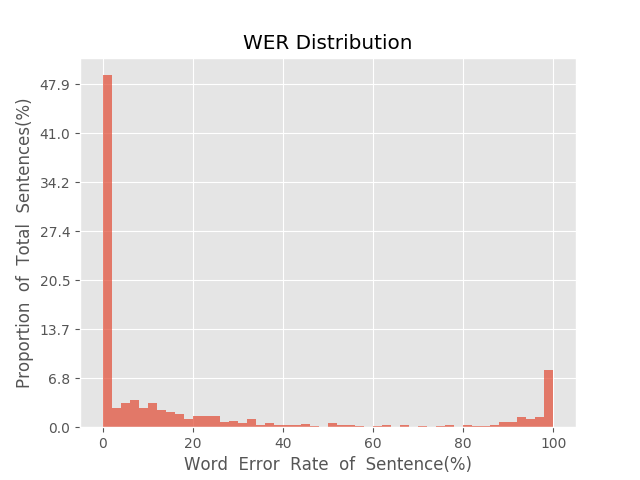
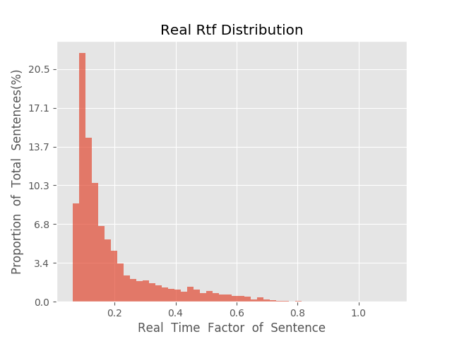

测 试 报 告

>	测试ID: a2b97724-5afc-11eb-aa60-0242ac110007
>	开始时间: 2021-01-20 16:19:25
>	结束时间: 2021-01-20 16:52:08
>	测试引擎: 2.0:/home/admin/v2.6.3_16K
>	测试模型: /home/user/linjr/tmp_model/smbr_29e3d9d2c7cd44c99c4cdf38836c1e06_1611128606.net

##1. 句错误率分布

##2. 实时率分布

##3. 字错误率
22.07%
##4. rtf加权平均
0.2

