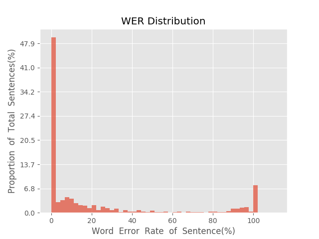
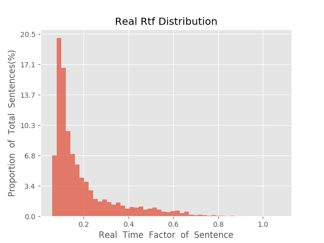

测 试 报 告

>	测试ID: 68b476b8-5b0c-11eb-b38e-0242ac110007
>	开始时间: 2021-01-20 18:12:20
>	结束时间: 2021-01-20 18:45:02
>	测试引擎: 2.0:/home/admin/v2.6.3_16K
>	测试模型: /home/user/linjr/tmp_model/smbr_64d044ba59424d79b6b557bcc8237a63_1611137284.net

##1. 句错误率分布

##2. 实时率分布

##3. 字错误率
22.05%
##4. rtf加权平均
0.2

