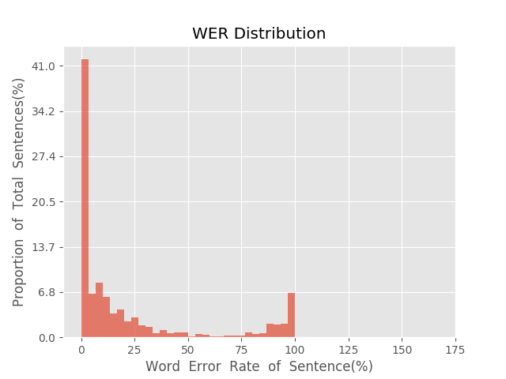
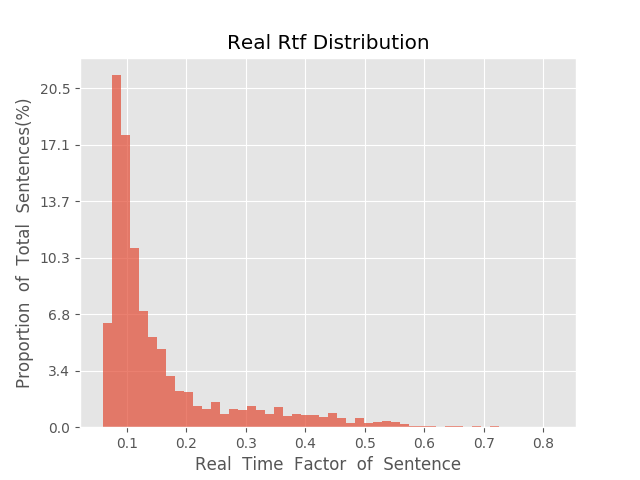

测 试 报 告

>	测试ID: 93a47e66-5b68-11eb-878a-0242ac110007
>	开始时间: 2021-01-21 05:12:07
>	结束时间: 2021-01-21 05:44:48
>	测试引擎: 2.0:/home/admin/v2.6.3_16K
>	测试模型: /home/user/linjr/tmp_model/smbr_8e16289691fc49d98e79f8393f79857e_1611176870.net

##1. 句错误率分布

##2. 实时率分布

##3. 字错误率
23.09%
##4. rtf加权平均
0.17

