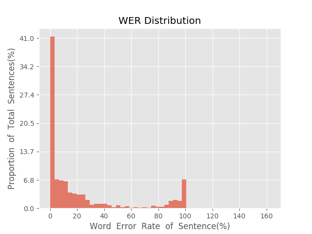
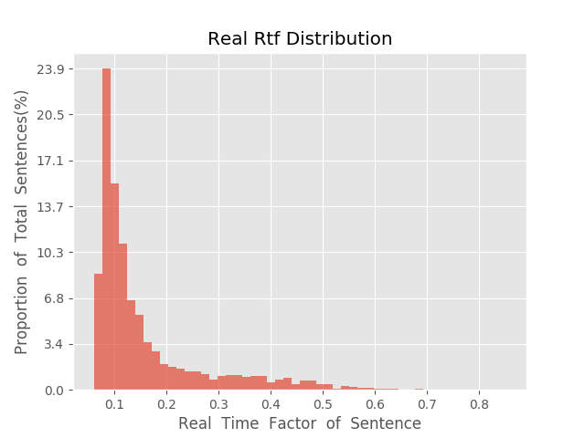

测 试 报 告

>	测试ID: 85fa77fc-5bc2-11eb-8117-0242ac110007
>	开始时间: 2021-01-21 15:54:57
>	结束时间: 2021-01-21 16:28:40
>	测试引擎: 2.0:/home/admin/v2.6.3_16K
>	测试模型: /home/user/linjr/tmp_model/smbr_8946989b2950452281616b2630128e32_1611215441.net

##1. 句错误率分布

##2. 实时率分布

##3. 字错误率
23.39%
##4. rtf加权平均
0.17

