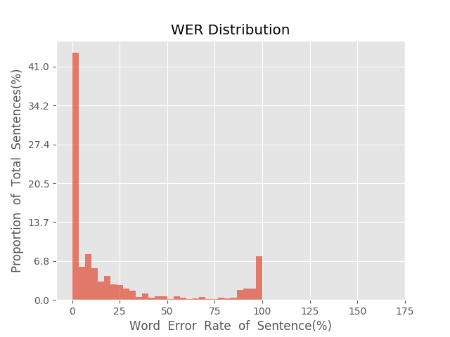
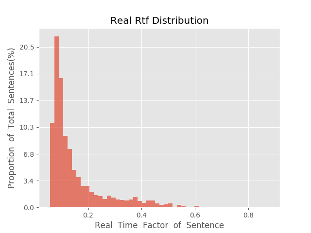

测 试 报 告

>	测试ID: fe83dd4a-5c20-11eb-8aa4-0242ac110007
>	开始时间: 2021-01-22 03:10:57
>	结束时间: 2021-01-22 03:44:55
>	测试引擎: 2.0:/home/admin/v2.6.3_16K
>	测试模型: /home/user/linjr/tmp_model/smbr_fe6514dfc059494aa13845bc5108bc84_1611255997.net

##1. 句错误率分布

##2. 实时率分布

##3. 字错误率
23.33%
##4. rtf加权平均
0.16

