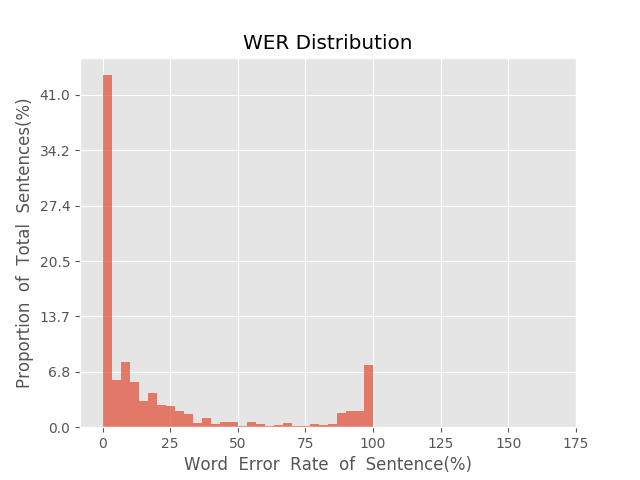
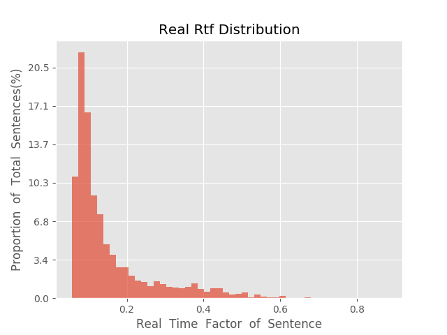

测 试 报 告

>	测试ID: d5fa7bee-5c76-11eb-ae80-0242ac110007
>	开始时间: 2021-01-22 13:39:40
>	结束时间: 2021-01-22 13:59:23
>	测试引擎: 2.0:/home/admin/v2.6.3_16K
>	测试模型: /home/user/linjr/tmp_model/smbr_2c5018ce4f02423880ade53a3d93f34b_1611293722.net

##1. 句错误率分布

##2. 实时率分布

##3. 字错误率
23.33%
##4. rtf加权平均
0.16

