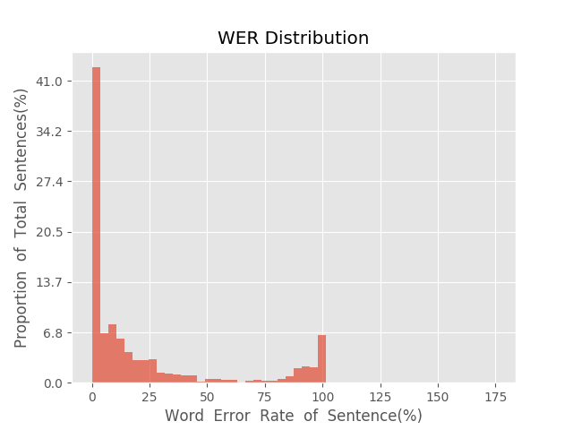
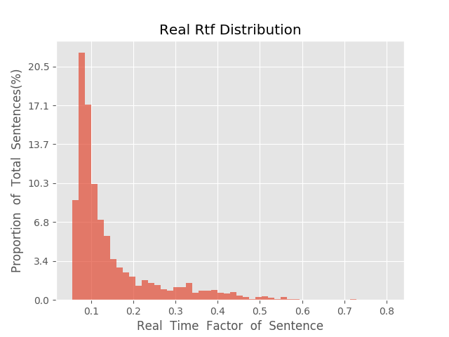

测 试 报 告

>	测试ID: 6c011ab2-5cd1-11eb-976a-0242ac110007
>	开始时间: 2021-01-23 00:13:21
>	结束时间: 2021-01-23 00:47:50
>	测试引擎: 2.0:/home/admin/v2.6.3_16K
>	测试模型: /home/user/linjr/tmp_model/smbr_e78d8538183e45408ab5574803b722ec_1611331742.net

##1. 句错误率分布

##2. 实时率分布

##3. 字错误率
23.13%
##4. rtf加权平均
0.15

