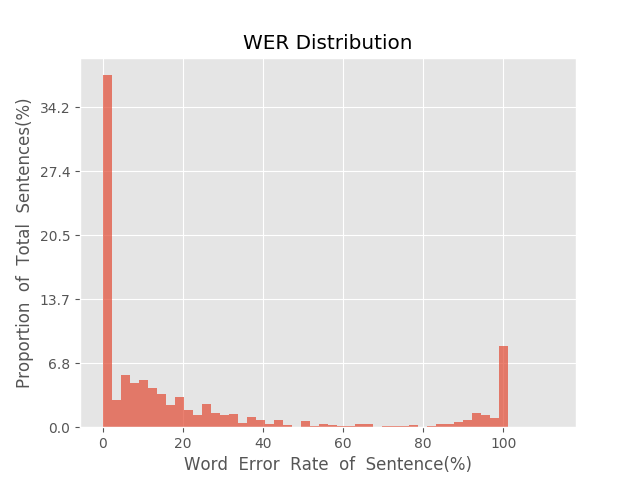
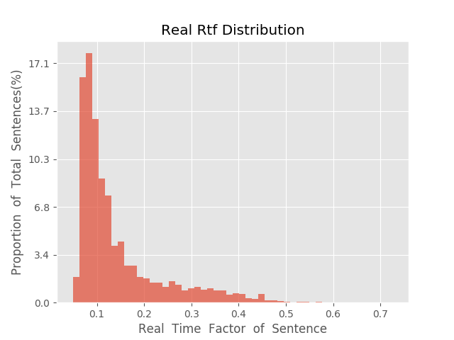

测 试 报 告

>	测试ID: 8485dc02-5d54-11eb-a98e-0242ac110007
>	开始时间: 2021-01-23 15:52:22
>	结束时间: 2021-01-23 16:26:15
>	测试引擎: 2.0:/home/admin/v2.6.3_16K
>	测试模型: /home/user/linjr/tmp_model/smbr_5a656da46f2d4fe69f0bff8199911fb9_1611388081.net

##1. 句错误率分布

##2. 实时率分布

##3. 字错误率
24.34%
##4. rtf加权平均
0.15

