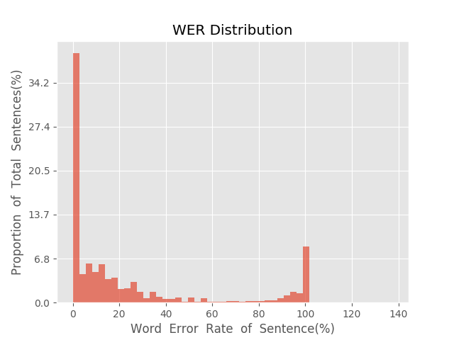
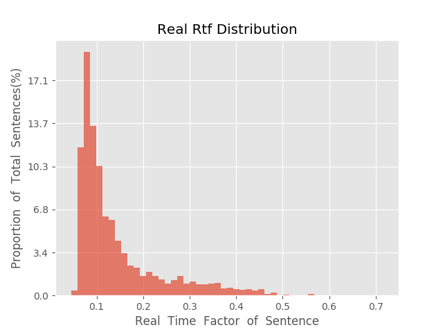

测 试 报 告

>	测试ID: 2befd62c-5dd3-11eb-b560-0242ac110007
>	开始时间: 2021-01-24 06:59:28
>	结束时间: 2021-01-24 07:32:53
>	测试引擎: 2.0:/home/admin/v2.6.3_16K
>	测试模型: /home/user/linjr/tmp_model/smbr_e418bcf5563846e5b0c64bdf86fad0c1_1611442507.net

##1. 句错误率分布

##2. 实时率分布

##3. 字错误率
24.48%
##4. rtf加权平均
0.15

