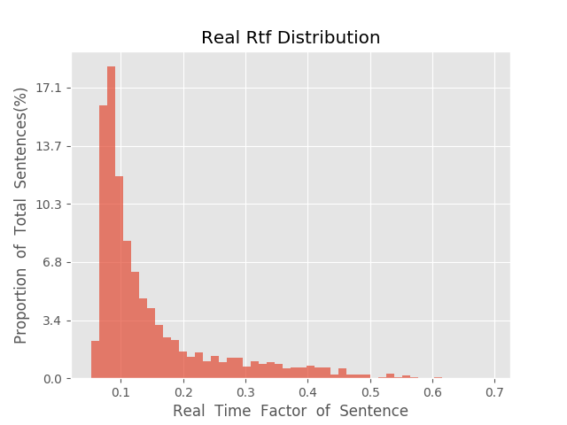

测 试 报 告

>	测试ID: 520a02c0-5e4f-11eb-9ddd-0242ac110007
>	开始时间: 2021-01-24 21:47:14
>	结束时间: 2021-01-24 22:21:34
>	测试引擎: 2.0:/home/admin/v2.6.3_16K
>	测试模型: /home/user/linjr/tmp_model/smbr_edaeffef85fe4e59b7d1e524a4d6ef04_1611495776.net

##1. 句错误率分布

##2. 实时率分布

##3. 字错误率
24.33%
##4. rtf加权平均
0.16

