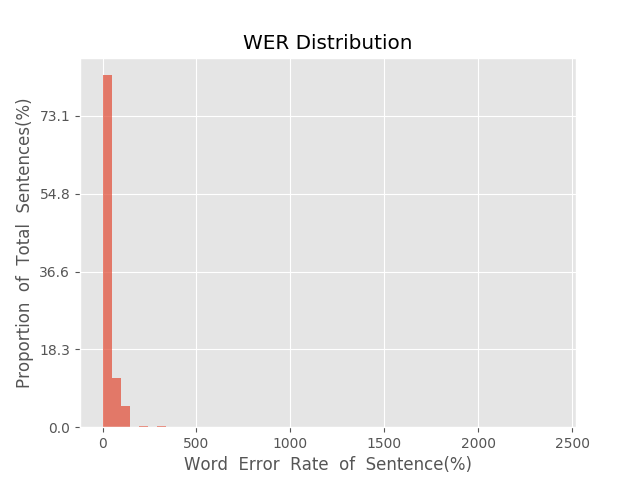
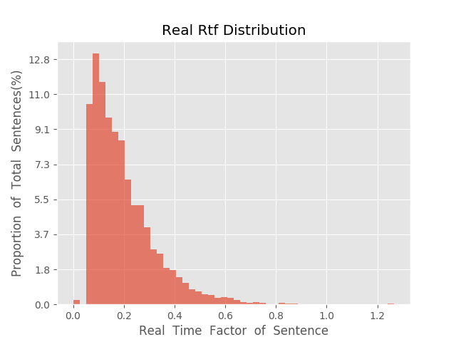

测 试 报 告

>	测试ID: 7ef2b982-f49f-11e9-a374-20040fe7e638
>	开始时间: 2019-10-22 15:22:39
>	结束时间: 2019-10-22 15:43:28
>	测试引擎: 2.0:/home/admin/v2.6_16K
>	测试模型: /home/user/hezw/tmp_model/smbr_f9efcac8bce54429ac4d645e54d84d8e_1571723795.net

##1. 句错误率分布

##2. 实时率分布

##3. 字错误率
19.59%
##4. rtf加权平均
0.2

