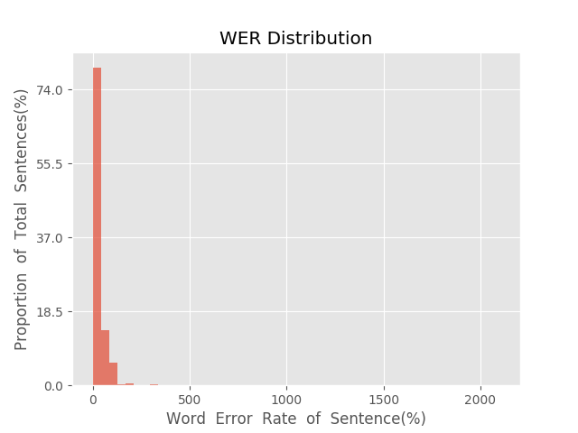
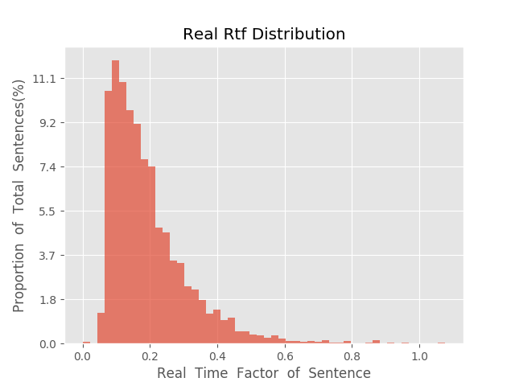

测 试 报 告

>	测试ID: e27f1fe4-f4aa-11e9-8132-20040fe7e638
>	开始时间: 2019-10-22 16:44:04
>	结束时间: 2019-10-22 17:05:00
>	测试引擎: 2.0:/home/admin/v2.6_16K
>	测试模型: /home/user/hezw/tmp_model/smbr_885abe69952044e4b2ca8a58ab1c2b82_1571718456.net

##1. 句错误率分布

##2. 实时率分布

##3. 字错误率
20.38%
##4. rtf加权平均
0.19

