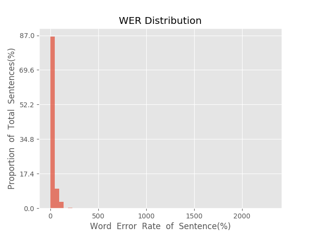
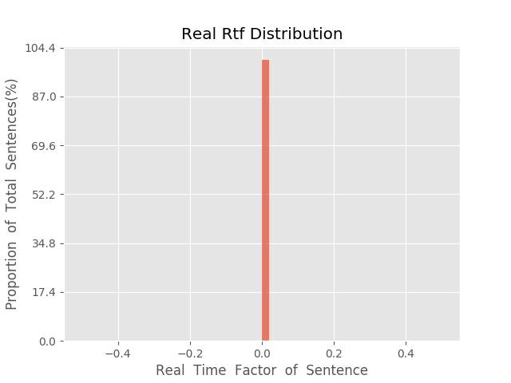

测 试 报 告

>	测试ID: 37db6986-f936-11e9-a8d8-20040fe7e638
>	开始时间: 2019-10-28 11:11:52
>	结束时间: 2019-10-28 11:52:28
>	测试引擎: 2.0:/home/admin/v2.6_16K
>	测试模型: /home/user/hezw/work_py/auto_train/corpus/model/fsmn.net.sc

##1. 句错误率分布

##2. 实时率分布

##3. 字错误率
16.47%
##4. rtf加权平均
nan

