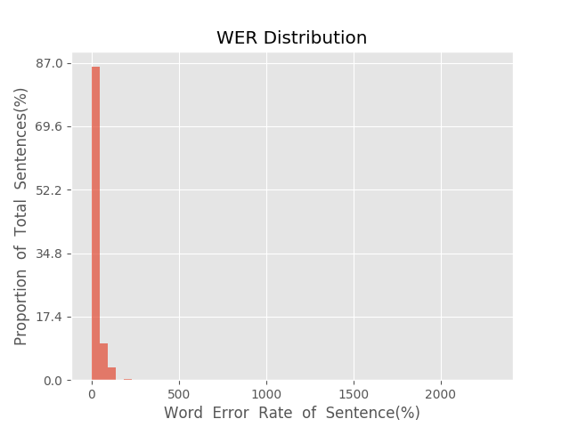
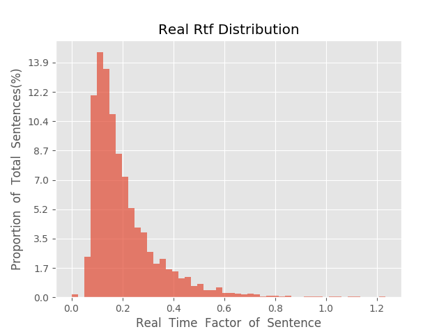

测 试 报 告

>	测试ID: fcdfddd4-f93b-11e9-a8d8-20040fe7e638
>	开始时间: 2019-10-28 11:51:49
>	结束时间: 2019-10-28 12:33:46
>	测试引擎: 2.0:/home/admin/v2.6_16K
>	测试模型: /home/user/hezw/tmp_model/smbr_79a87111a73548d8aa1a187f9a4286b1_1572049007.net

##1. 句错误率分布

##2. 实时率分布

##3. 字错误率
17.01%
##4. rtf加权平均
0.2

