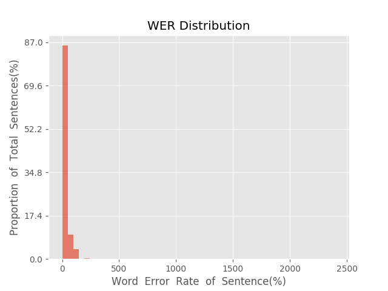
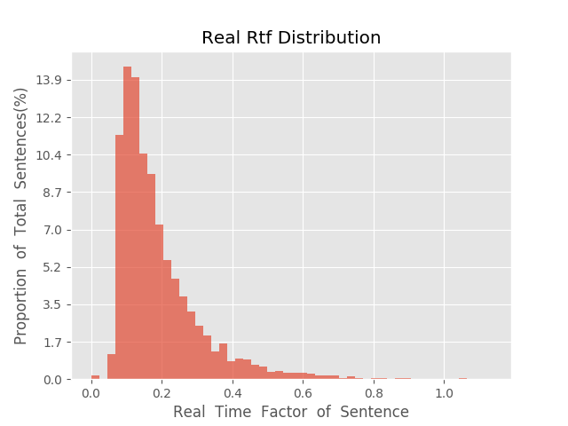

测 试 报 告

>	测试ID: 1f5d6f60-f947-11e9-a8d8-20040fe7e638
>	开始时间: 2019-10-28 13:12:35
>	结束时间: 2019-10-28 13:53:28
>	测试引擎: 2.0:/home/admin/v2.6_16K
>	测试模型: /home/user/hezw/tmp_model/smbr_28d70dbb4e494cc8a5f8c9d89a05c0ae_1572190601.net

##1. 句错误率分布

##2. 实时率分布

##3. 字错误率
17.34%
##4. rtf加权平均
0.19

