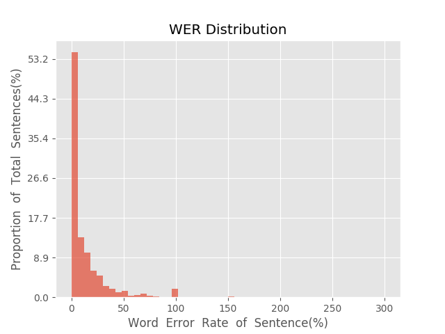
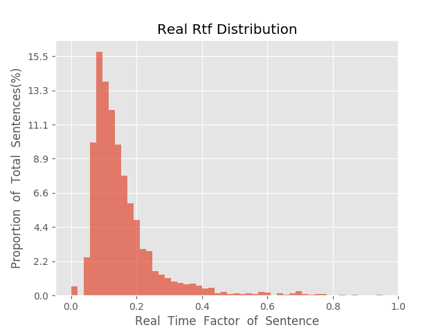

测 试 报 告

>	测试ID: b12d6bca-3907-11ea-b170-0242ac110002
>	开始时间: 2020-01-17 16:24:22
>	结束时间: 2020-01-17 17:00:39
>	测试引擎: 2.0:/home/admin/v2.6.3_16K
>	测试模型: /home/user/linjr/auto_train/corpus/model/fsmn.net

##1. 句错误率分布

##2. 实时率分布

##3. 字错误率
10.93%
##4. rtf加权平均
0.15

